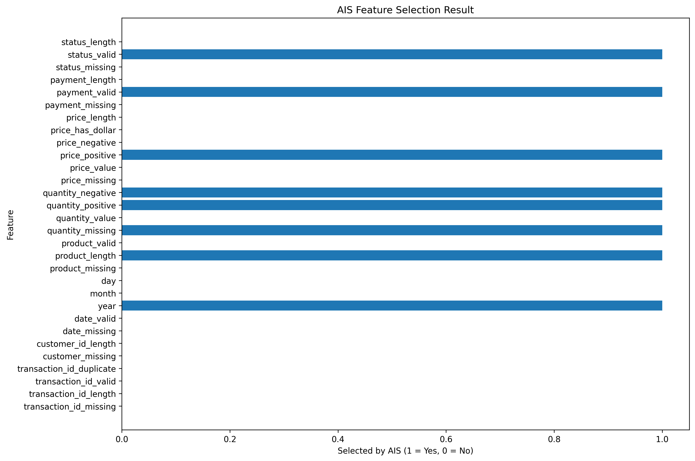

# 💳 AI-Based Financial Transaction Data Quality & Wrongness Prediction

An intelligent **Financial Transaction Data Quality Detection System** that identifies incorrect, incomplete, inconsistent, duplicated, and anomalous financial transaction records using **Artificial Neural Networks (ANN)** combined with optimization techniques such as **Artificial Immune System (AIS)** and **Particle Swarm Optimization (PSO)**.

The project analyzes dirty financial transaction data, automatically generates data-quality labels, extracts meaningful features, applies optimization-based feature selection, and predicts whether a transaction record should be considered **Clean** or **Anomalous**.

---

## 📌 Project Overview

Financial transaction datasets collected from real-world systems often contain data-quality problems such as:

- Missing transaction IDs
- Missing customer information
- Invalid transaction dates
- Duplicate transaction IDs
- Negative quantities
- Missing prices
- Negative or zero prices
- Corrupted product names
- Inconsistent payment methods
- Inconsistent transaction statuses
- Invalid categorical values
- Typographical errors

Poor-quality financial data can significantly affect downstream analytics, reporting, forecasting, and machine-learning applications.

This project develops an automated **data wrongness prediction system** capable of identifying these problematic transaction records.

The primary prediction problem is formulated as a **binary classification task**:

```text
0 = Clean Transaction
1 = Wrong / Anomalous Transaction
```

The project additionally applies **Artificial Immune System (AIS)** and **Particle Swarm Optimization (PSO)** for intelligent feature selection before training the final neural-network classifier.

---

# 🎯 Project Objectives

The major objectives of this project are:

1. Detect incorrect and anomalous financial transaction records.
2. Automatically identify multiple types of data-quality errors.
3. Generate a binary wrongness/anomaly target from validation rules.
4. Transform raw transaction data into machine-learning features.
5. Train an Artificial Neural Network for anomaly prediction.
6. Apply Artificial Immune System optimization for feature selection.
7. Apply Particle Swarm Optimization for feature selection.
8. Reduce unnecessary features while maintaining predictive performance.
9. Compare model performance using multiple evaluation metrics.
10. Generate prediction CSV files and graphical visualizations.
11. Store trained models and preprocessing information for future use.

---

# 📂 Dataset

The project uses the following dataset:

```text
dirty_financial_transactions.csv
```

The dataset contains approximately:

```text
100,000 transaction records
```

The primary attributes are:

| Feature | Description |
|---|---|
| `Transaction_ID` | Unique transaction identifier |
| `Transaction_Date` | Date on which the transaction occurred |
| `Customer_ID` | Unique customer identifier |
| `Product_Name` | Product associated with the transaction |
| `Quantity` | Quantity purchased |
| `Price` | Transaction/product price |
| `Payment_Method` | Method used for payment |
| `Transaction_Status` | Current transaction status |

The dataset intentionally contains various forms of dirty and inconsistent data, making it suitable for **data-quality anomaly prediction**.

---

# 🧹 Data Quality Problems

The system checks for several types of transaction errors.

## Transaction ID Errors

```text
Missing Transaction ID
Invalid Transaction ID
Duplicate Transaction ID
```

A transaction identifier is expected to follow an appropriate transaction-ID format.

## Customer ID Errors

```text
Missing Customer ID
Invalid Customer ID
```

Records without usable customer identification are considered problematic.

## Date Errors

The system converts transaction dates using:

```python
pd.to_datetime(..., errors="coerce")
```

This makes it possible to detect invalid dates such as impossible months or days.

Detected problems include:

```text
Missing Date
Invalid Date
```

## Product Errors

Expected product categories include:

```text
Laptop
Tablet
Smartphone
Headphones
Coffee Machine
```

Corrupted or incomplete product names can therefore be identified as data-quality problems.

Examples include:

```text
Lapt
Lapto
Tabl
Table
Ta
T
```

## Quantity Errors

The system checks for:

```text
Missing Quantity
Zero Quantity
Negative Quantity
```

A purchase quantity less than or equal to zero is treated as an invalid transaction quantity under the project's validation rules.

## Price Errors

The original price column may contain formatted values such as:

```text
$450.20
1250
$999.99
```

The preprocessing pipeline removes symbols such as `$` and converts the values into numerical representations.

The system detects:

```text
Missing Price
Invalid Price Format
Zero Price
Negative Price
```

## Payment Method Errors

Standard payment methods include:

```text
Credit Card
PayPal
Cash
```

Non-standard representations such as:

```text
creditcard
credit card
pay pal
```

are treated as data-quality inconsistencies.

## Transaction Status Errors

Standard statuses include:

```text
Completed
Pending
Failed
```

Variations such as:

```text
complete
completed
```

may indicate inconsistent categorical formatting.

---

# 🏷️ Automatic Wrongness Label Generation

Because the raw dataset does not contain a direct `Is_Anomaly` target, the project generates the target using predefined data-quality validation rules.

For every transaction:

```text
Error_Count = Total number of detected quality problems
```

The final target is:

```text
If Error_Count == 0:
    Is_Anomaly = 0

If Error_Count > 0:
    Is_Anomaly = 1
```

Therefore:

| Label | Meaning |
|---:|---|
| `0` | Clean transaction |
| `1` | Wrong / anomalous transaction |

The project also generates an `Error_Type` field describing the problems associated with each record.

Example:

```text
Invalid Date | Missing Price | Nonstandard Payment Method
```

---

# 🧠 Feature Engineering

Raw transaction attributes are transformed into numerical features suitable for machine learning.

Examples include:

```text
transaction_id_missing
transaction_id_length
transaction_id_valid
transaction_id_duplicate

customer_missing
customer_id_length

date_missing
date_valid
year
month
day

product_missing
product_length
product_valid

quantity_missing
quantity_value
quantity_positive
quantity_negative

price_missing
price_value
price_positive
price_negative
price_has_dollar
price_length

payment_missing
payment_valid
payment_length

status_missing
status_valid
status_length
```

These engineered features capture both transaction characteristics and indicators associated with data quality.

---

# 🧬 Artificial Immune System (AIS)

One of the primary optimization approaches implemented in this project is an **Artificial Immune System**, specifically a **Clonal Selection Algorithm**.

AIS is inspired by the adaptive behavior of the biological immune system.

The immune system identifies potentially harmful antigens, creates antibodies capable of recognizing them, clones effective antibodies, and mutates them to improve their effectiveness.

This concept is adapted for machine-learning feature optimization.

---

## AIS Representation

Each AIS antibody represents a possible feature subset.

For example:

```text
[1, 0, 1, 1, 0, 1, 0, ...]
```

where:

```text
1 = Feature selected
0 = Feature excluded
```

Suppose the available features are:

```text
Feature A
Feature B
Feature C
Feature D
Feature E
```

An antibody:

```text
[1, 0, 1, 0, 1]
```

means that AIS selects:

```text
Feature A
Feature C
Feature E
```

---

# 🧬 AIS Clonal Selection Process

The AIS optimization process follows these stages:

```text
Initialize Antibody Population
        ↓
Evaluate Fitness
        ↓
Select Best Antibodies
        ↓
Clone Elite Antibodies
        ↓
Mutate Clones
        ↓
Introduce Immune Diversity
        ↓
Evaluate New Population
        ↓
Repeat for Multiple Generations
        ↓
Select Best Feature Subset
        ↓
Train Final ANN
```

---

# 📐 AIS Fitness Function

Feature subsets are evaluated using a combination of:

```text
Predictive Performance
+
Feature Reduction
```

The implemented fitness function is:

```text
Fitness =
0.95 × F1 Score
+
0.05 × Feature Reduction
```

where:

```text
Feature Reduction =
1 - (Selected Features / Total Features)
```

This encourages AIS to find a subset that maintains strong classification performance while avoiding unnecessary features.

A lightweight **Logistic Regression** classifier is used during optimization so that many candidate feature subsets can be evaluated efficiently.

The final classification model remains the **Artificial Neural Network**.

---

# 🧬 AIS Feature Selection Visualization

The following graph shows which engineered features were selected by the Artificial Immune System:



In this visualization:

```text
1 = Feature selected by AIS
0 = Feature rejected by AIS
```

The graph provides a clear representation of the final optimized feature subset used by the AIS-based neural-network pipeline.

---

# 🐝 Particle Swarm Optimization (PSO)

The project also implements **Particle Swarm Optimization** as an alternative feature-selection technique.

PSO is a population-based optimization algorithm inspired by the collective movement of organisms such as bird flocks and fish schools.

Each particle represents a possible feature subset.

---

## PSO Particle Representation

Similar to AIS, a particle can be represented as:

```text
[1, 0, 1, 1, 0, ...]
```

where:

```text
1 = Selected
0 = Not selected
```

Each particle searches the feature space while learning from:

```text
Its own best solution
+
The swarm's global best solution
```

---

# ⚙️ Binary PSO

Since feature selection is a binary problem, the project uses **Binary Particle Swarm Optimization**.

Particle velocity is updated using:

```text
v(t+1) =
w × v(t)
+
c1 × r1 × (PersonalBest - CurrentPosition)
+
c2 × r2 × (GlobalBest - CurrentPosition)
```

where:

| Parameter | Meaning |
|---|---|
| `w` | Inertia weight |
| `c1` | Cognitive coefficient |
| `c2` | Social coefficient |
| `r1` | Random cognitive component |
| `r2` | Random social component |

Velocity is transformed into a probability using the sigmoid function:

```text
Sigmoid(v) = 1 / (1 + e^(-v))
```

The resulting probability determines whether each feature is selected.

---

# 🔄 PSO Optimization Workflow

```text
Initialize Particle Swarm
        ↓
Generate Feature Masks
        ↓
Calculate Particle Fitness
        ↓
Update Personal Best
        ↓
Update Global Best
        ↓
Update Particle Velocity
        ↓
Apply Sigmoid Transformation
        ↓
Update Binary Position
        ↓
Repeat for Multiple Iterations
        ↓
Select Global Best Feature Subset
        ↓
Train ANN
```

---

# 🤖 Artificial Neural Network

After feature optimization, the selected features are passed to an **Artificial Neural Network** implemented using TensorFlow/Keras.

The architecture is:

```text
Input Layer
     ↓
Dense Layer – 128 neurons – ReLU
     ↓
Batch Normalization
     ↓
Dropout – 30%
     ↓
Dense Layer – 64 neurons – ReLU
     ↓
Batch Normalization
     ↓
Dropout – 25%
     ↓
Dense Layer – 32 neurons – ReLU
     ↓
Dropout – 20%
     ↓
Dense Layer – 16 neurons – ReLU
     ↓
Output Layer – 1 neuron – Sigmoid
```

---

# ⚙️ ANN Configuration

The neural network uses:

```text
Optimizer: Adam
Learning Rate: 0.001
Loss Function: Binary Crossentropy
Maximum Epochs: 50
Batch Size: 256
Output Activation: Sigmoid
Prediction Threshold: 0.50
```

---

# 🛑 Early Stopping

The model uses **Early Stopping** to reduce unnecessary training and help prevent overfitting.

```text
Monitor: Validation Loss
Patience: 7 epochs
Restore Best Weights: True
```

If validation performance stops improving, training can terminate before reaching the maximum number of epochs.

---

# 📉 Learning Rate Reduction

The project additionally uses:

```text
ReduceLROnPlateau
```

When validation loss stops improving, the learning rate is reduced.

This allows the neural network to perform smaller parameter updates as training progresses.

---

# ⚖️ Class Imbalance Handling

Data-quality datasets may contain unequal numbers of clean and anomalous transactions.

The project therefore calculates class weights from the training dataset.

Conceptually:

```text
Class Weight =
Total Training Samples
/
(2 × Number of Samples in Class)
```

The weights are supplied to the ANN during training.

---

# 📊 Model Evaluation

The final models are evaluated using several metrics.

## Accuracy

Accuracy represents the overall percentage of correctly classified transactions.

```text
Accuracy =
Correct Predictions / Total Predictions
```

## Precision

Precision measures how many transactions predicted as anomalous were actually anomalous.

```text
Precision =
TP / (TP + FP)
```

High precision means fewer clean transactions are incorrectly classified as anomalous.

## Recall

Recall measures how many actual anomalous transactions were successfully detected.

```text
Recall =
TP / (TP + FN)
```

High recall means fewer wrong records are missed.

## F1 Score

The F1 score balances precision and recall.

```text
F1 =
2 × (Precision × Recall)
/
(Precision + Recall)
```

F1 score is also used as the primary predictive component of the AIS and PSO feature-selection fitness functions.

## ROC-AUC

ROC-AUC evaluates the model's ability to separate clean and anomalous transactions across different classification thresholds.

A larger ROC-AUC indicates better discrimination between the two classes.

---

# 🔥 Confusion Matrix

The confusion matrix summarizes predictions into four categories:

| | Predicted Clean | Predicted Anomaly |
|---|---:|---:|
| **Actual Clean** | True Negative | False Positive |
| **Actual Anomaly** | False Negative | True Positive |

This helps determine whether the system is:

- Correctly detecting anomalies
- Missing anomalous transactions
- Incorrectly flagging clean transactions

---

# 📈 Generated Visualizations

The project automatically generates and saves multiple visualizations.

## AIS Accuracy Graph

```text
ais_accuracy_graph.png
```

Shows:

```text
Training Accuracy
vs
Validation Accuracy
```

over neural-network training epochs.

---

## AIS Heatmap

```text
ais_heatmap.png
```

Displays the confusion matrix for the AIS-optimized ANN.

---

## AIS Comparison Graph

```text
ais_comparison_graph.png
```

Compares:

```text
Accuracy
Precision
Recall
F1 Score
ROC-AUC
```

---

## AIS Result Graph

```text
ais_result_graph.png
```

Shows the distribution of different data-quality problems found in the financial transaction dataset.

---

## AIS Prediction Graph

```text
ais_prediction_graph.png
```

Visualizes:

```text
Actual Transaction Label
vs
AIS Prediction Probability
```

with a classification threshold of:

```text
0.50
```

---

## AIS Optimization History

```text
ais_optimization_history_graph.png
```

Shows how the best antibody fitness evolves across AIS generations.

---

## AIS Feature Selection

```text
ais_feature_selection_graph.png
```

### Main Visualization


---

# 📁 Project Structure

```text
Financial Transaction Data Quality/
│
├── dirty_financial_transactions.csv
├── README.md
│
├── financial_data_quality_model.h5
├── financial_data_quality_pipeline.pkl
├── financial_data_quality_config.yaml
├── financial_data_quality_results.json
├── accuracy_graph.png
├── heatmap.png
├── comparison_graph.png
├── result.csv
├── result_graph.png
├── prediction.csv
├── prediction_graph.png
├── financial_data_quality_labeled.csv
│
├── ais_financial_data_quality_model.h5
├── ais_financial_data_quality_pipeline.pkl
├── ais_financial_data_quality_config.yaml
├── ais_financial_data_quality_results.json
├── ais_accuracy_graph.png
├── ais_heatmap.png
├── ais_comparison_graph.png
├── ais_result.csv
├── ais_result_graph.png
├── ais_prediction.csv
├── ais_prediction_graph.png
├── ais_feature_selection.csv
├── ais_feature_selection_graph.png
├── ais_optimization_history.csv
├── ais_optimization_history_graph.png
├── ais_labeled_dataset.csv
│
├── pso_financial_data_quality_model.h5
├── pso_financial_data_quality_pipeline.pkl
├── pso_financial_data_quality_config.yaml
├── pso_financial_data_quality_results.json
├── pso_accuracy_graph.png
├── pso_heatmap.png
├── pso_comparison_graph.png
├── pso_result.csv
├── pso_result_graph.png
├── pso_prediction.csv
├── pso_prediction_graph.png
├── pso_feature_selection.csv
├── pso_feature_selection_graph.png
├── pso_optimization_history.csv
├── pso_optimization_history_graph.png
└── pso_labeled_dataset.csv
```

---

# 📄 Output Files

## H5 Models

```text
ais_financial_data_quality_model.h5
pso_financial_data_quality_model.h5
```

These files contain the trained TensorFlow/Keras neural-network models.

## PKL Pipelines

```text
ais_financial_data_quality_pipeline.pkl
pso_financial_data_quality_pipeline.pkl
```

These store:

- `StandardScaler`
- Selected features
- All generated features
- Prediction threshold
- Optimization results
- Valid categories

## YAML Configuration

```text
ais_financial_data_quality_config.yaml
pso_financial_data_quality_config.yaml
```

These contain:

- Dataset information
- Optimization parameters
- ANN configuration
- Selected features
- Evaluation metrics

## JSON Results

```text
ais_financial_data_quality_results.json
pso_financial_data_quality_results.json
```

These contain:

- Accuracy
- Precision
- Recall
- F1 Score
- ROC-AUC
- Confusion matrix
- Selected features
- Optimization history
- Training history

---

# 📑 Result CSV

The AIS result CSV:

```text
ais_result.csv
```

contains:

```text
Error_Type
Error_Count
Percentage
```

Example structure:

| Error_Type | Error_Count | Percentage |
|---|---:|---:|
| Invalid Date | ... | ... |
| Missing Price | ... | ... |
| Invalid Product | ... | ... |
| Nonstandard Payment Method | ... | ... |
| Missing Status | ... | ... |

This summarizes the major forms of data wrongness detected in the dataset.

---

# 🔮 Prediction CSV

The AIS prediction file:

```text
ais_prediction.csv
```

contains information such as:

```text
Transaction_ID
Transaction_Date
Customer_ID
Product_Name
Quantity
Price
Payment_Method
Transaction_Status
Actual_Label
Actual_Result
AIS_Prediction_Probability
AIS_Predicted_Label
AIS_Predicted_Result
Correct_Prediction
Error_Count
Error_Type
```

The PSO version produces corresponding `PSO_...` prediction fields.

---

# 🧪 Complete Model Pipeline

```text
              Financial Transaction Dataset
                          │
                          ▼
                 Data Quality Analysis
                          │
                          ▼
               Data Validation Rules
                          │
                          ▼
                 Wrongness Labeling
                          │
                          ▼
                 Feature Engineering
                          │
             ┌────────────┴────────────┐
             ▼                         ▼
     AIS Feature Selection      PSO Feature Selection
             │                         │
             ▼                         ▼
    Optimized Feature Set      Optimized Feature Set
             │                         │
             └────────────┬────────────┘
                          ▼
                  Standard Scaling
                          │
                          ▼
              Artificial Neural Network
                          │
                          ▼
                Clean / Anomaly
                    Prediction
                          │
                          ▼
                 Model Evaluation
                          │
                          ▼
       Accuracy • Precision • Recall • F1 • AUC
                          │
                          ▼
          CSV • H5 • PKL • YAML • JSON
                          │
                          ▼
              Graphical Visualization
```

---

# 🚀 Installation

Install the required Python packages:

```bash
pip install pandas numpy matplotlib scikit-learn tensorflow pyyaml joblib
```

Alternatively, create a `requirements.txt` file:

```text
pandas
numpy
matplotlib
scikit-learn
tensorflow
pyyaml
joblib
```

Then run:

```bash
pip install -r requirements.txt
```

---

# ▶️ Running the Project

Place:

```text
dirty_financial_transactions.csv
```

inside:

```text
C:\Users\sagni\Downloads\Financial Transaction Data Quality
```

The implementations can be organized as:

```text
main.py
ais_model.py
pso_model.py
```

Run the base implementation:

```bash
python main.py
```

Run the AIS implementation:

```bash
python ais_model.py
```

Run the PSO implementation:

```bash
python pso_model.py
```

After execution, model files, CSV files, configuration files, results, and graphs are automatically stored inside the project directory.

---

# 🧬 AIS vs PSO

| Characteristic | AIS | PSO |
|---|---|---|
| Inspiration | Biological immune system | Swarm intelligence |
| Candidate solution | Antibody | Particle |
| Search mechanism | Cloning + mutation | Velocity + position |
| Memory | Elite antibodies | Personal/global best |
| Diversity | Mutation/random antibodies | Swarm movement |
| Feature representation | Binary mask | Binary particle |
| Fitness objective | F1 + feature reduction | F1 + feature reduction |
| Final classifier | ANN | ANN |

Both optimization algorithms attempt to identify a compact and effective feature subset before neural-network training.

---

# 💡 Why Use Feature Selection?

Not every generated feature contributes equally to prediction.

Feature selection can help:

- Remove redundant features
- Reduce model complexity
- Reduce computational requirements
- Improve interpretability
- Reduce noise
- Potentially improve generalization

AIS and PSO provide population-based alternatives to conventional deterministic feature-selection approaches.

---

# ⚠️ Important Interpretation

This project performs:

> **Financial Transaction Data Quality / Wrongness Prediction**

It should **not** automatically be interpreted as a financial fraud detection system.

An anomalous record means that the transaction contains one or more predefined data-quality problems.

For example:

```text
Transaction Date = 2025-02-30
```

would be anomalous because the date is impossible.

Similarly:

```text
Quantity = -7
```

would be anomalous because a negative purchase quantity violates the project's validation rules.

These records may represent:

- Data-entry mistakes
- Corrupted records
- Missing information
- Formatting problems
- Inconsistent categories
- Duplicate records
- Invalid numerical values

They do **not necessarily represent fraudulent financial activity**.

---

# ⚠️ Methodological Note

The target variable is generated from deterministic data-quality rules.

Several engineered features intentionally capture signals closely related to those same rules, such as:

```text
date_valid
quantity_negative
product_valid
payment_valid
status_valid
```

Therefore, very high classification accuracy is possible.

High accuracy should not automatically be interpreted as evidence that the model can detect previously unknown forms of financial fraud or arbitrary real-world anomalies.

The correct interpretation is:

> **The model learns to predict whether a transaction is likely to violate the data-quality criteria represented in the training labels.**

For stronger future experiments, manually reviewed labels or externally validated data-quality labels could be used.

---

# 🔬 Future Improvements

The project can be extended with:

1. **Isolation Forest** for unsupervised anomaly detection.
2. **Autoencoders** for reconstruction-based anomaly detection.
3. **XGBoost** for tabular classification.
4. **Random Forest** as a conventional machine-learning baseline.
5. **SHAP** for model explainability.
6. **Fuzzy matching** for corrupted product names.
7. **Multi-class error prediction** instead of binary classification.
8. **Real-time transaction validation APIs**.
9. **Streamlit dashboard** for interactive analysis.
10. **Database integration** for large transaction datasets.
11. **Hybrid AIS-PSO optimization**.
12. **Cross-validation** for stronger evaluation.
13. **Manual or expert-verified anomaly labels**.
14. **Unknown anomaly detection** beyond predefined rules.

---

# 🌐 Real-World Applications

## Banking

Detect malformed or incomplete transaction records before they enter analytical systems.

## E-Commerce

Validate customer purchases, quantities, product information, and payment data.

## Accounting

Detect inconsistent financial records before reporting.

## Data Warehousing

Improve transaction quality before ETL pipelines load records into analytical warehouses.

## Machine Learning

Improve input data quality before downstream predictive models are trained.

## Financial Analytics

Reduce unreliable analytical results caused by corrupted transaction data.

---

# 🛠️ Technologies Used

- Python
- Pandas
- NumPy
- TensorFlow
- Keras
- Scikit-learn
- Matplotlib
- Joblib
- PyYAML
- JSON
- Artificial Neural Networks
- Artificial Immune System
- Clonal Selection Algorithm
- Particle Swarm Optimization
- Binary PSO

---

# 📌 Research Problem

Financial datasets frequently contain missing, inconsistent, corrupted, duplicated, and logically invalid transaction records.

Traditional manual data-quality validation becomes increasingly difficult when datasets contain thousands or millions of transactions.

This project investigates whether **machine learning combined with bio-inspired optimization** can be used to construct an automated transaction data-quality prediction framework.

---

# 🎓 Research Objective

> **To develop an intelligent financial transaction data-quality prediction system capable of detecting incorrect, incomplete, inconsistent, duplicated, and anomalous records using machine learning, Artificial Neural Networks, Artificial Immune System optimization, and Particle Swarm Optimization.**

---

# 📝 Conclusion

This project presents an automated framework for **Financial Transaction Data Quality and Wrongness Prediction**.

The system first applies domain-inspired validation rules to identify common data-quality problems and construct transaction-level anomaly labels. It then performs feature engineering to transform raw financial transaction information into numerical representations suitable for machine learning.

An **Artificial Neural Network (ANN)** performs the final binary classification between clean and anomalous transactions.

To improve the feature-selection process, two bio-inspired optimization approaches are implemented:

- **Artificial Immune System (AIS)**
- **Particle Swarm Optimization (PSO)**

AIS applies a clonal-selection strategy in which promising feature subsets are selected, cloned, mutated, and reevaluated.

PSO represents feature subsets as particles that move through the search space using personal and global best solutions.

The resulting framework produces:

- Trained machine-learning models
- Data-quality labels
- Prediction files
- Optimization histories
- Feature-selection results
- Performance metrics
- Graphical visualizations
- H5, PKL, YAML, and JSON artifacts

Overall, the project demonstrates how **data validation, machine learning, neural networks, and bio-inspired optimization** can be combined to build an automated system for identifying problematic financial transaction records.

---

# 📊 Main Project Visualization


The visualization illustrates the feature subset identified by the **Artificial Immune System**, providing an interpretable view of which engineered transaction-quality indicators were retained for final model training.

---

# ⭐ Project Summary

| Item | Details |
|---|---|
| **Project** | AI-Based Financial Transaction Data Quality & Wrongness Prediction |
| **Dataset** | `dirty_financial_transactions.csv` |
| **Dataset Size** | Approximately 100,000 transactions |
| **Target** | `Is_Anomaly` |
| **Class 0** | Clean Transaction |
| **Class 1** | Wrong / Anomalous Transaction |
| **Base Classifier** | Artificial Neural Network |
| **Optimization 1** | Artificial Immune System |
| **AIS Method** | Clonal Selection |
| **Optimization 2** | Particle Swarm Optimization |
| **PSO Method** | Binary PSO |
| **Metrics** | Accuracy, Precision, Recall, F1 Score, ROC-AUC |
| **Main Visualization** | `ais_feature_selection_graph.png` |

---

## 📊 Visualization


---

## ⭐ Support

If you find this project useful, consider giving the repository a **⭐ star**.

---

**AI-Based Financial Transaction Data Quality & Wrongness Prediction**

*Combining Artificial Neural Networks, Artificial Immune Systems, and Particle Swarm Optimization for intelligent financial data-quality analysis.*
